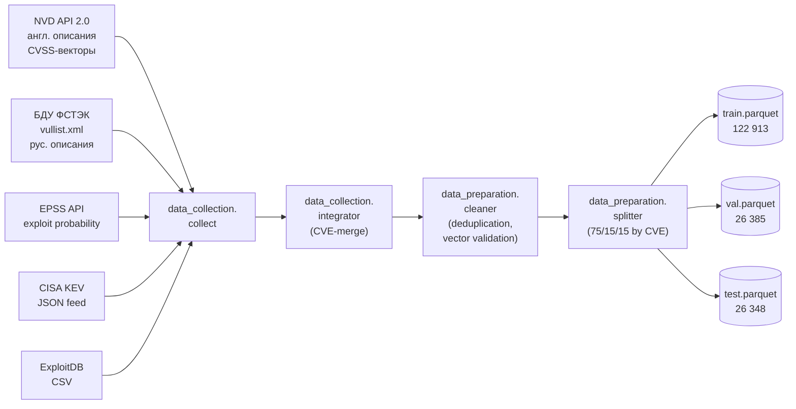
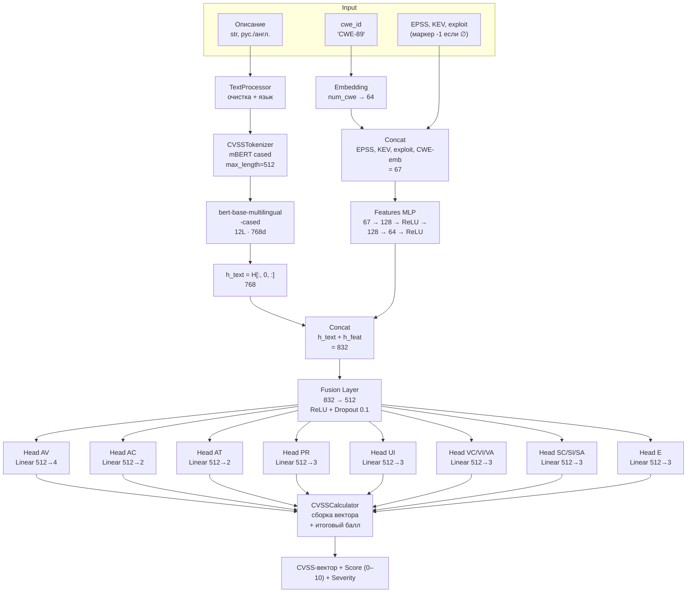

# Архитектура системы

Документ описывает архитектурные решения, принятые при разработке системы
автоматической оценки критичности уязвимостей по CVSS v4.0. Назначение и
обоснование каждого технического решения зафиксированы в [CLAUDE.md](../CLAUDE.md).

## Содержание

1. [Двухэтапная стратегия обучения](#двухэтапная-стратегия-обучения)
2. [Pipeline подготовки данных](#pipeline-подготовки-данных)
3. [Архитектура модели](#архитектура-модели)
4. [Компоненты системы](#компоненты-системы)
5. [Обоснование архитектурных решений](#обоснование-архитектурных-решений)
6. [Технические характеристики](#технические-характеристики)

---

## Двухэтапная стратегия обучения

CVSS v4.0 опубликован в ноябре 2023 г., и на момент проведения экспериментов
(2026 г.) насчитывается лишь ~6 700 публично доступных уязвимостей с разметкой
по этому стандарту (NVD + БДУ ФСТЭК). В то же время CVSS v3.1 размечено более
260 тыс. уязвимостей — это на два порядка больший корпус.

Прямое обучение на 4,7 тыс. v4.0-записях даёт неустойчивую модель,
переобучающуюся на специфике предметной области. Поэтому применена **двухэтапная
стратегия**:

### Stage 1 — Pre-training на CVSS v3.1

Обучаются **8 общих метрик**, совпадающих между v3.1 и v4.0:
`AV, AC, PR, UI, VC, VI, VA, E` (в v3.1 — `C, I, A` соответственно, но
семантика эквивалентна). Голова `E` использует Exploit Code Maturity, имеющую
ту же шкалу классов.

| Параметр | Значение |
|:--|--:|
| Корпус | 122 913 train / 26 385 val |
| Learning rate | 2 · 10⁻⁵ |
| Batch size | 32 |
| Max epochs | 10 |
| Dropout | 0,1 |
| Weight decay | 0,01 |
| Early stopping patience | 3 |

Результат: модель **достаточно понимает русский и английский текст ИБ-описаний**
и умеет извлекать признаки эксплуатируемости.

### Stage 2 — Fine-tuning на CVSS v4.0

Дообучаются **все 12 метрик**. Веса голов `AT, SC, SI, SA` (отсутствуют в v3.1)
**инициализируются случайно**; общая голова `E` переинициализируется тоже —
поскольку набор её классов сократился (`A, P, U` вместо `H, F, U, X`).
Остальные 8 голов наследуют веса Stage 1.

| Параметр | Значение |
|:--|--:|
| Корпус | 4 715 train / 1 041 val |
| Learning rate | 1 · 10⁻⁵ |
| Batch size | 16 |
| Max epochs | 20 |
| Optimizer | AdamW |
| Scheduler | linear warmup (10%) + linear decay |
| Seed | 42 |

Critical: train/val/test разбиение выполнено **по уникальному CVE-идентификатору
ДО разделения на наборы Stage 1 / Stage 2**, чтобы исключить утечку данных
(одна CVE никогда не оказывается одновременно в train Stage 1 и в test
Stage 2).

---

## Pipeline подготовки данных



Все этапы — детерминированные. При фиксированном `seed=42` повторный запуск
полностью воспроизводит исходные сплиты.

---

## Архитектура модели



---

## Компоненты системы

### 1. CVSSTokenizer (`src/data_preparation/tokenizer_wrapper.py`)

Тонкая обёртка над Hugging Face `AutoTokenizer` для `bert-base-multilingual-cased`.

* Обрабатывает русский и английский **одним токенизатором** (mBERT обучен на
  104 языках, словарь WordPiece покрывает кириллицу и латиницу).
* Между описанием и `cwe_name` ставится `[SEP]`, в начале — `[CLS]`, в конце —
  `[SEP]` (добавляются автоматически).
* `max_length = 512` с `truncation=True` и `padding='max_length'`.
* Поддерживает `tokenize_batch` для пакетной инференс-обработки (используется
  в `predictor.predict_batch` и в API).

### 2. FeaturesEncoder (`src/data_preparation/features_encoder.py`)

Кодирует три структурированных признака эксплуатируемости:

| Признак | Тип | Маркер ∅ |
|:--|:--|:--|
| EPSS | float (0..1) | `-1.0` |
| KEV | int (0/1) | `-1` |
| exploit (ExploitDB) | int (0/1) | `-1` |

Маркер `-1` (а не 0, 0.5 или NaN) выбран намеренно: модель учится отличать
«признак есть, значение 0» от «признака нет». На выходе — вектор размерности 3.

### 3. CWEEncoder (`src/data_preparation/cwe_encoder.py`)

Преобразует строку `'CWE-89'` в целочисленный индекс по словарю
`data/processed/cwe_vocab.json` (≈350 уникальных CWE на train set).
Неизвестные CWE отображаются в индекс UNK = 0.

Далее индекс пропускается через `Embedding(num_cwe, 64)` — обучаемый слой
встраиваний внутри `CVSSModel`.

### 4. CVSSModel (`src/model/cvss_model.py`)

Полная архитектура:

```python
forward(input_ids, attention_mask, cwe_idx, features):
    h_text  = mBERT(input_ids, attention_mask).last_hidden_state[:, 0, :]   # 768
    cwe_emb = self.cwe_embedding(cwe_idx)                                    # 64
    f_ext   = concat(features, cwe_emb)                                      # 67
    h_feat  = self.features_mlp(f_ext)                                       # 64
    h       = concat(h_text, h_feat)                                         # 832
    h_fused = self.fusion_layer(h)                                           # 512
    return {metric: head(h_fused) for metric, head in self.heads.items()}    # 12 logits
```

Возвращает словарь логитов по каждой из 12 метрик.

### 5. MultiTaskLoss (`src/training/loss.py`)

Сумма кросс-энтропий по обучаемым метрикам:

```
L = Σ_{i=1..N} CE(logits_i, y_i),    N=8 на Stage 1, N=12 на Stage 2
```

Веса метрик равные. Эксперименты с обратно-частотным взвешиванием не дали
устойчивого прироста F1 на miнорных классах, поэтому в production-варианте
используется простая равновесная сумма.

### 6. Trainer (`src/training/trainer.py`)

Универсальный train loop для обеих стадий:

* `train_one_epoch` / `evaluate` с автоматическим перемещением батчей на устройство;
* Mixed precision (`torch.amp.autocast`) — ускорение на T4 в ~1,7 раза;
* TensorBoard logging (loss, per-metric F1, learning rate);
* checkpointing best-by-val-loss + last;
* Linear warmup (10% шагов) + linear decay через `get_linear_schedule_with_warmup`;
* Early stopping (patience=3) по `val_loss`;
* Воспроизводимость: фиксация seed в `torch`, `numpy`, `random`,
  `transformers.set_seed`.

### 7. CVSSCalculator (`src/cvss_calculator/`)

Собственная реализация алгоритма CVSS v4.0 по [спецификации FIRST](https://www.first.org/cvss/v4.0/specification-document).
Запрет на использование сторонних библиотек-калькуляторов — обязательное
требование раздела 1.3.6 отчёта (требование самостоятельной реализации).

Четырёхэтапный алгоритм:

1. **MacroVector**: 12 метрик → 6 групп эквивалентности (EQ1…EQ6) → строка
   из 6 цифр (например, `'012010'`).
2. **Базовый балл**: lookup по таблице из 264 значений
   (`src/cvss_calculator/macro_vectors.py`).
3. **Severity Distances (интерполяция)**: поправка по расстояниям от текущих
   метрик до наихудшего случая в группе, с ограничением `min(total, 0.5)`.
4. **Exploit Maturity модификатор**: умножение на коэффициент
   k_E = 1,0 (A) / 0,94 (P) / 0,91 (U), округление до одного знака.

Возвращает `(score, severity, vector)`. Severity по таблице FIRST:
0,0 → None, 0,1–3,9 → Low, 4,0–6,9 → Medium, 7,0–8,9 → High, 9,0–10,0 → Critical.

---

## Обоснование архитектурных решений

### Почему mBERT, а не XLM-R или Llama?

* **Двуязычность из коробки.** mBERT обучен на 104 языках. Русские и английские
  описания одной модели — без переключения чекпоинтов.
* **Размер.** mBERT-cased = 178 М параметров. XLM-R-large = 560 М, требует
  кратно больше VRAM. На Tesla T4 (16 ГБ) комфортно помещается batch=32 с FP16.
* **Хорошее покрытие домена.** mBERT натренирован на Wikipedia + CommonCrawl —
  технический корпус, близкий к описаниям уязвимостей. RuBERT и SciBERT
  одноязычны; задача требует обработки обоих языков.
* **Стабильность дообучения.** Encoder-only архитектура с CLS-токеном проще
  настраивается под классификацию, чем decoder-only Llama (требует instruction
  tuning).

### Почему двухэтапное обучение?

Прямое fine-tuning на 4,7 тыс. v4.0-записях даёт macro-F1 ≈ 0,55 — модель
переобучается. Pre-training на v3.1 (122 тыс. записей) формирует:

* устойчивые признаки для AV/AC/PR/UI/Impact-метрик,
* семантическое представление для русского технического текста ИБ,
* инициализацию голов, которые в v4.0 совпадают по смыслу.

В результате Stage 2 поднимает macro-F1 до 0,71 (+0,16) за счёт переноса
знания.

### Почему переинициализация AT/SC/SI/SA/E?

* **AT, SC, SI, SA — новые** в v4.0, не имеют эквивалентов в v3.1.
* **E** — формально присутствует в v3.1, но **набор классов изменился**:
  v3.1 → `{H, F, U, P, X}`, v4.0 → `{A, P, U}`. Перенос весов привёл бы к
  путанице семантик.

Остальные 7 голов (AV, AC, PR, UI, VC, VI, VA) сохраняют веса Stage 1 — их
семантика идентична.

### Почему `-1` как маркер отсутствующих признаков?

Альтернативы и их проблемы:

* **NaN**: невозможно подать в Linear-слой без специальной маски.
* **0**: путается с реальным значением EPSS=0 (вероятность ровно 0).
* **0,5**: вводит шум — модель решит, что «отсутствие» = «среднее значение».
* **Дополнительный one-hot флаг «missing»**: удваивает размерность.

`-1` лежит вне физического диапазона признаков (EPSS ∈ [0, 1], KEV ∈ {0, 1}),
не требует дополнительной маски и легко интерпретируется первым же
Linear-слоем как «outlier» → специальный токен «отсутствует».

---

## Технические характеристики

| Характеристика | Значение |
|:--|:--|
| Общее число параметров | **178 358 563** (~178 М) |
| Размер чекпоинта (FP32) | ~440 МБ |
| Размер чекпоинта (FP16) | ~220 МБ |
| Predicted метрик | 12 (классификация) |
| Max sequence length | 512 токенов mBERT |
| CWE-словарь | ~350 уникальных идентификаторов |
| Время инференса (CPU, batch=1) | ~200 мс |
| Время инференса (CPU, batch=16) | ~80 мс на запись |
| Время инференса (GPU T4, batch=16) | ~15 мс на запись |
| Полная prediction-цепочка | от описания до score < 250 мс на CPU |

---

См. также:

- [docs/training.md](training.md) — практическое руководство по обучению;
- [docs/api.md](api.md) — REST API спецификация;
- [CLAUDE.md](../CLAUDE.md) — паспорт проекта со всеми требованиями ВКР.
